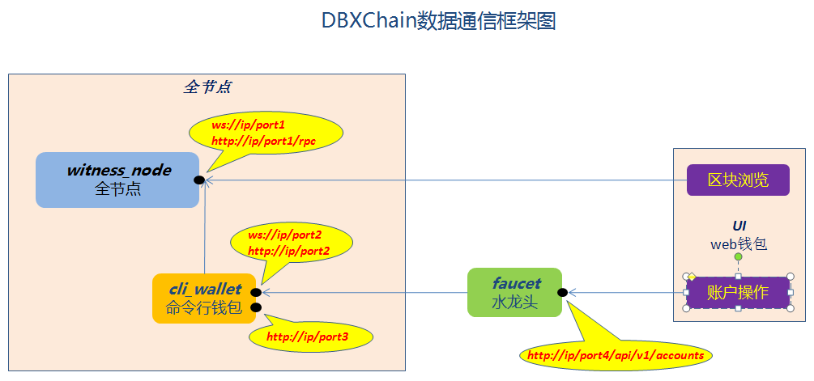

# MyGChain构成

MyGChain主要有`core`、`ui`、`faucet`三大部分组成：

## 1. core

chain节点程序，基于石墨烯技术，C++开发。core 主要由`链核心模块`和`命令行钱包`程序组成。

- **链核心模块**

  全节点，即witness_node程序， 通过 P2P 方式连接到MyGChain网络，从网络接收最新区块，向网络广播本地签署的交易包。

- **命令行钱包**

  即cli_wallet程序， 通过 websocket 方式连接到 witness_node， 管理钱包文件； 提供交易签名功能，签名后通过 witness_node 向外广播； 通过 http rpc 的方式提供 API 供其他程序调用。

## 2. ui

`web在线钱包` —— 区块浏览器，同时也是在线的钱包。web形式的浏览器客户端，基于Nodejs开发。

## 3. faucet

水龙头，用于web钱包客户端连接，用以注册链上账户使用。它基于ruby开发。